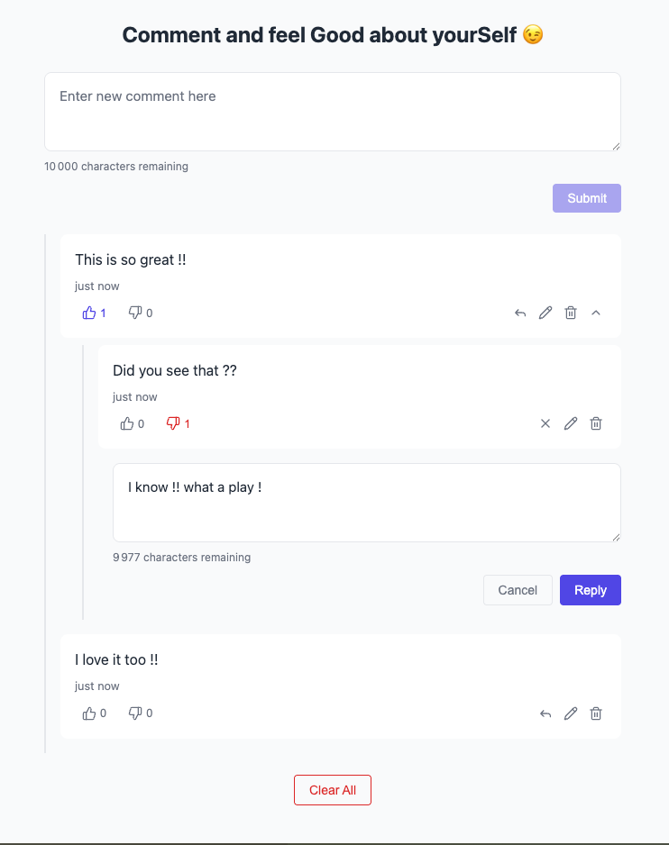

# GoodSelf Comments App

A modern, feature-rich comments application built with React and TypeScript. Supports nested replies, likes/dislikes, and real-time persistence.


## Features

- **Nested Comments** - Unlimited depth threading with visual hierarchy
- **Like/Dislike System** - Vote on comments with toggle support
- **Inline Editing** - Edit comments in place with validation
- **Collapsible Threads** - Collapse/expand nested comment trees
- **Smooth Animations** - Framer Motion powered transitions
- **Keyboard Navigation** - Full keyboard support for accessibility
- **XSS Protection** - Sanitized user input with safe link detection
- **localStorage Persistence** - Comments and votes survive page refresh
- **Error Boundaries** - Graceful error handling with recovery
- **Responsive Design** - Works across all screen sizes

## Demo

<!-- Add screenshot or GIF demo here -->


## Installation

```bash
# Clone the repository
git clone https://github.com/your-username/goodself-comments-app.git
cd goodself-comments-app

# Install dependencies
npm install

# Start development server
npm run dev

# Build for production
npm run build

# Preview production build
npm run preview
```

## Architecture Overview

```
src/
├── components/           # React components
│   ├── CommentForm/      # Comment input form
│   ├── CommentItem/      # Individual comment display
│   ├── ClearAllButton/   # Clear all comments action
│   ├── ConfirmModal/     # Confirmation dialog
│   ├── ErrorBoundary/    # Error handling wrapper
│   └── shared/           # Reusable UI components
├── hooks/                # Custom React hooks
│   ├── useComments.ts    # Comment CRUD operations
│   ├── useUserVotes.ts   # Vote state management
│   ├── useCommentForm.ts # Form logic and validation
│   ├── useCommentItem.ts # Comment item interactions
│   └── useModal.ts       # Modal state management
├── services/             # Business logic services
│   ├── logger.ts         # Configurable logging
│   ├── validation.ts     # Input validation
│   └── storage.ts        # localStorage persistence
├── state/                # State management
│   ├── context.tsx       # Comments provider
│   ├── reducer.ts        # State reducer
│   └── selectors.ts      # State selectors
├── types/                # TypeScript definitions
└── utils/                # Utility functions
    ├── sanitize.ts       # XSS prevention
    ├── tree.ts           # Tree traversal
    └── time.ts           # Time formatting
```

### State Management

The app uses React Context with useReducer for state management:

```
┌─────────────────────────────────────────────────────────┐
│                    CommentsProvider                      │
│  ┌─────────────────────────────────────────────────┐    │
│  │                 CommentsState                    │    │
│  │  ┌──────────────┐    ┌───────────────────────┐  │    │
│  │  │   rootIds    │    │         byId          │  │    │
│  │  │  [id1, id2]  │    │  { id1: CommentNode } │  │    │
│  │  └──────────────┘    └───────────────────────┘  │    │
│  └─────────────────────────────────────────────────┘    │
│                           │                              │
│                     commentsReducer                      │
│                           │                              │
│    ADD │ EDIT │ DELETE │ TOGGLE │ LIKE │ DISLIKE │ CLEAR │
└─────────────────────────────────────────────────────────┘
```

### Data Flow

```
User Action → Hook (useComments) → Dispatch → Reducer → New State
                                                            │
                                              localStorage ←─┘
```

## Keyboard Shortcuts

| Action | Shortcut |
|--------|----------|
| Submit comment | `Enter` |
| New line in comment | `Shift + Enter` |
| Cancel editing/reply | `Escape` |
| Start reply (when focused) | `Enter` |

## Tech Stack

- **React 18** - UI library with concurrent features
- **TypeScript** - Type-safe development
- **Vite** - Fast build tool and dev server
- **Framer Motion** - Animation library
- **Lucide React** - Icon library
- **CSS Modules** - Scoped component styling

## Project Structure

### Components

Each component follows a consistent structure:
- `ComponentName.tsx` - Main component
- `ComponentName.module.css` - Scoped styles
- `index.ts` - Public exports

### Hooks

Custom hooks encapsulate reusable logic:
- `useComments` - CRUD operations for comments
- `useUserVotes` - Track user's likes/dislikes
- `useCommentForm` - Form state and validation
- `useCommentItem` - Individual comment interactions

### Services

Business logic separated from components:
- `logger` - Structured logging with configurable transports
- `validation` - Comment text validation rules
- `storage` - localStorage persistence layer

## Future Improvements

- [ ] User authentication system
- [ ] Server-side persistence with API
- [ ] Real-time updates via WebSockets
- [ ] Comment sorting options (newest, oldest, most liked)
- [ ] Search and filter functionality
- [ ] Markdown support in comments
- [ ] Image attachments
- [ ] Comment mentions (@user)
- [ ] Export/import comments
- [ ] Dark mode theme

## Contributing

1. Fork the repository
2. Create a feature branch (`git checkout -b feature/amazing-feature`)
3. Commit your changes (`git commit -m 'Add amazing feature'`)
4. Push to the branch (`git push origin feature/amazing-feature`)
5. Open a Pull Request

## License

MIT License - see [LICENSE](LICENSE) for details.
